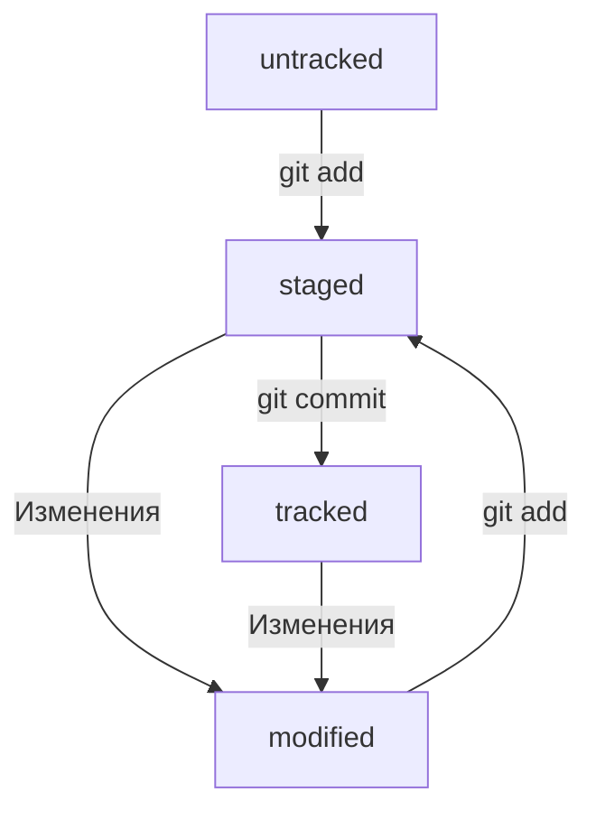

# Шпаргалка про GIT
[Проект на GiHub](https://github.com/tochmary/about-git/blob/master/README.md)
Создан Ларионовой М.А. 06.03.2025

## Создание репозитория на GitHub
Примечание: 
* На GitHub уже есть аккаунт
* Созданы ssh ключи 

---

1. Создать удаленный репозиторий на GitHub:

1.1. Зайдите в свой профиль [по ссылке](https://github.com/tochmary), где вместо **tochmary** ваше имя, которое вы указали при регистрации.

1.2. Создайте репозиторий. Для этого перейдите на вкладку Repositories, а затем нажмите на зелёную кнопку New справа.

1.3. Открылось окно создания нового репозитория. Назовите его **about-git**.

1.4. Нажмите на зелёную кнопку Create repository внизу.

1.5. Запомните url репозитория с типом ssh, например **git@github.com:tochmary/about-git.git**.

---

2. Создание папки для локального репозитория и необходимых файлов в терминале:

2.1. Перейти в папку для репозиторий

```bash
cd Practicum_QA_JAVA/GIT_QA_JAVA/about-git
```
2.2. Создать папку для локального репозитория

```bash
mkdir about-git
```
2.3. Создать файлы touch README.md (в блокноте запишите в него всё, что уже знаете)

```bash
touch README.md
```
2.4. Сделать папку репозиторием

```bash
git init
```
2.5. Проверить состояние репозитория

```bash
git status
```
2.6. Подготовить файлы к сохранению

```bash
git add --all
```
2.7. Выполнить коммит с ключом -m

```bash
git commit -m "создан проект про git"
```

2.8. Привязать удалённый репозиторий к локальному, используя url в 1.5.

```bash
git remote add origin git@github.com:tochmary/about-git.git
```

2.9. Отправить изменения на удалённый репозиторий

```bash
git push -u origin master
```
---

3. Проверить репозиторий на GitHub [по ссылке](https://github.com/tochmary/about-git).

---

4. После изменения файлов выполнить в терминале:

```bash
git status
git add --all
git commit -m "Изменения файла1"
git push 
```
---

## Краткая информация

1. **Хеш — основной идентификатор коммита**
* Git преобразует информацию о коммитах с помощью алгоритма SHA-1 и для каждого из них рассчитывает уникальный идентификатор — хеш.
* Хеш — основной идентификатор коммита и позволяет узнать его автора, дату и содержимое закоммиченных файлов.
* Все хеши, а также таблицу соответствий хеш → информация о коммите Git хранит в папке .git.

2. **git log — команда для получения лога**
- После вызова git log появляется список коммитов. Элементы, из которых состоит описание:

    - строка из цифр и латинских букв после слова commit — это хеш коммита;

    - Author — имя автора и его электронная почта;

    - Date — дата и время создания коммита;

    - в конце находится сообщение коммита.

- Можно вызвать не только полный лог, но и сокращённый — это делается командой git log --oneline.
- В сокращённом логе выводятся сокращённые хеши — их можно использовать точно так же, как и полные.

3. **HEAD — файл, который указывает на последний коммит**
* HEAD указывает на коммит, который сделан последним (то есть на самый новый). В этом можно убедиться с помощью терминала. Перейдите в папку .git командой cd. Посмотрите содержимое файла HEAD командой cat.
```bash
cat HEAD # команда cat показывает содержимое файла
ref: refs/heads/master # в файле вот такая ссылка 
```
* В числе прочих файлов в папке .git есть служебный файл HEAD. Он указывает на самый свежий коммит.
* Вместо хеша последнего коммита можно написать слово HEAD — Git вас поймёт.
* После изменения файлов выполнить в терминале. 

4. **Статусы файлов в Git**
* *untracked* (англ. «неотслеживаемый»)
Мы говорили, что новые файлы в Git-репозитории помечаются как untracked, то есть неотслеживаемые. Git «видит», что такой файл существует, но не следит за изменениями в нём. У untracked-файла нет предыдущих версий, зафиксированных в коммитах или через команду git add.
* *staged* (англ. «подготовленный»)
После выполнения команды git add файл попадает в staging area (от англ. stage — «сцена», «этап [процесса]» и area — «область»), то есть в список файлов, которые войдут в коммит. В этот момент файл находится в состоянии staged.
* *tracked* (англ. «отслеживаемый»)
Состояние tracked — это противоположность untracked. Оно довольно широкое по смыслу: в него попадают файлы, которые уже были зафиксированы с помощью git commit, а также файлы, которые были добавлены в staging area командой git add. То есть все файлы, в которых Git так или иначе отслеживает изменения.
* *modified* (англ. «изменённый»)
Состояние modified означает, что Git сравнил содержимое файла с последней сохранённой версией и нашёл отличия. Например, файл был закоммичен и после этого изменён.



6. **Оформление сообщений к коммитам**
Правильно описывать коммиты — искусство, к которому стоит приобщиться как можно раньше. Хорошо, когда:
* сообщение коммита легко читается;
* оно информативное;
* все сообщения оформлены в одном стиле